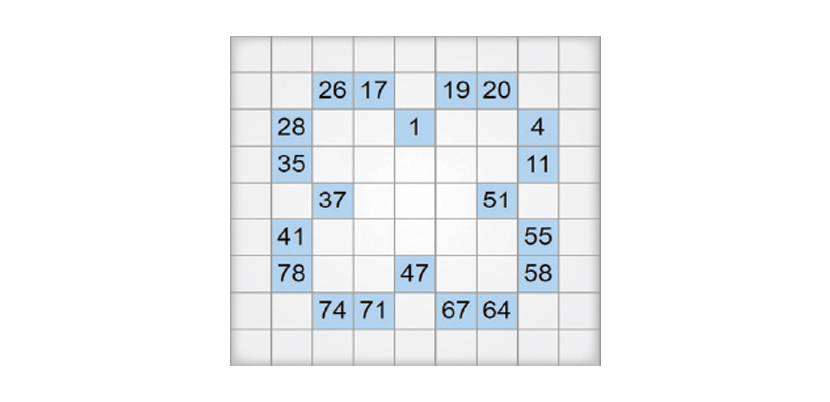

# Numbrix (Hidato) Generator

[Hidato or Numbrix](https://en.wikipedia.org/wiki/Hidato) is a logic puzzle game. The goal of the game is to fill the grid with consecutive numbers that connect horizontally, vertically, or diagonally.

This implementation generates a rectangular grid path to build these puzzles. Every well-formed Hidato puzzle is supposed to have a unique solution that the implementation provides. As with every Hidato puzzle, this implementation pinpoints the smallest and highest numbers on the grid.

All the code is released to Public Domain. Patches and comments are welcome.
It makes me happy to hear if someone finds the implementations useful.

Ehsan Marufi 
April 2013